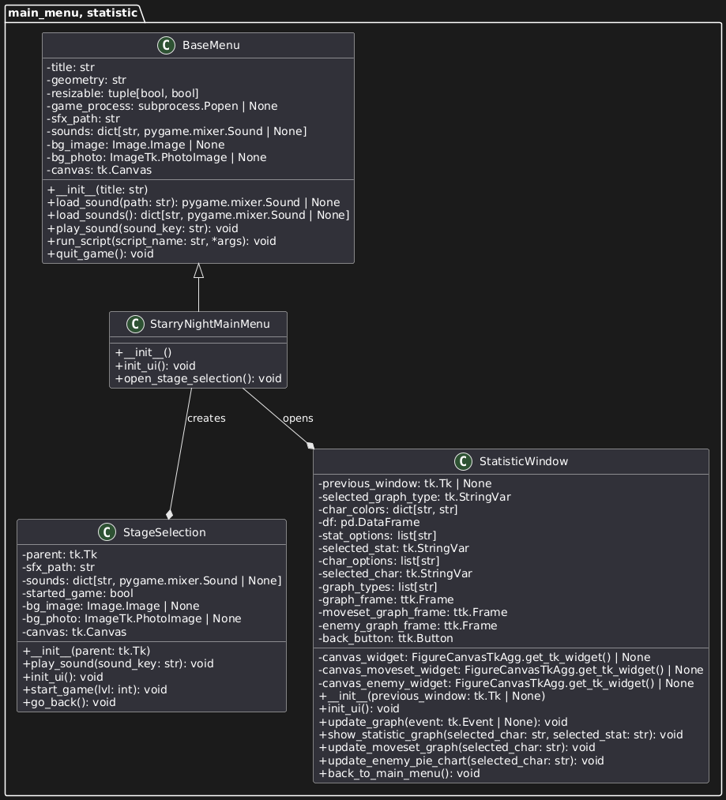
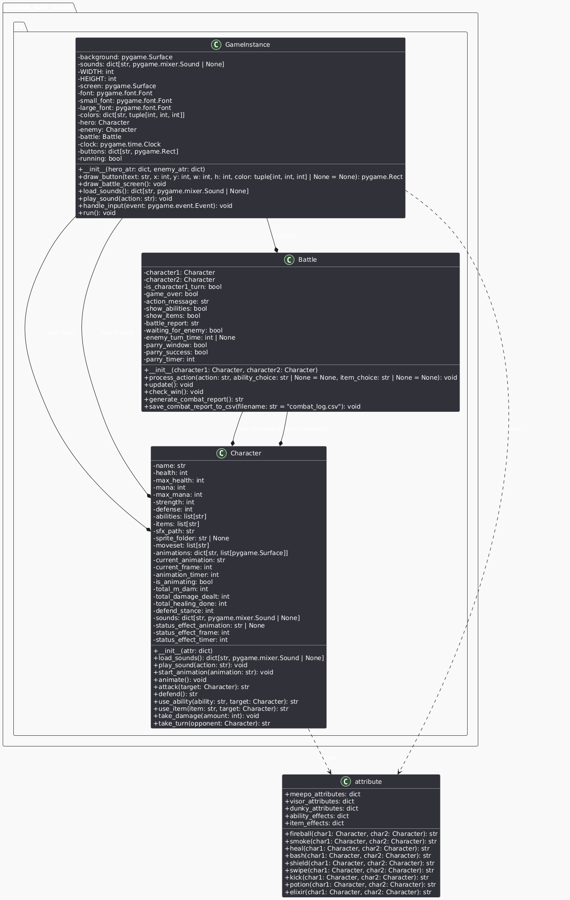

# Starry night 
## Project Overview & Concept
Starry Night is a hybrid turn-based and action-oriented dungeon adventure RPG, drawing inspiration from the strategic depth of Final Fantasy's turn-based system and the reactive gameplay of Clair Obscur: Expedition 33's parry mechanic. The game features a combat system that blends strategic decision-making with skillful timing:

- Turn-Based Combat (Final Fantasy Inspired): In encounters with significant foes, the combat shifts to a strategic turn-based system reminiscent of Final Fantasy. Players must carefully consider their actions each turn – choosing to attack, defend, utilize a unique ability, or employ an item. Enemies will respond with their own distinct sets of moves, demanding tactical planning and adaptation to survive.

- Parry System (Clair Obscur: Expedition 33 Inspired): Encounters emphasize a dynamic parry system inspired by Clair Obscur: Expedition 33. This system replaces traditional turn-based exchanges with faster, reflex-driven combat where every enemy action demands careful attention, as a mistimed parry can lead to significant damage. However, successfully executing a precise parry is highly rewarding, offering a crucial window for powerful counter-attacks and potentially turning the tide of the fight swiftly. This injects a constant sense of tension and engagement into these battles, making each encounter a test of timing and reflexes.

This combination of strategic turn-based combat and a reactive parry system aims to deliver a unique and compelling gameplay experience, demanding both thoughtful planning against formidable opponents and skillful timing against more agile threats.

## Features

- Turn-based battle system with strategic choices
- Multiple characters (Meepo, Visor, Dunky) with unique abilities and sprites
- Animated sprite attacks and visual effects
- GUI-based main menu using Tkinter
- Data collection: total damage, healing, parries, etc.
- Sound effects for actions and animations
- Visualization of player performance and statistics
## Data Recording Method
- CSV File: Each battle generates a row of data saved to a CSV file, tracking actions, performance, and results.
## Data Analysis
Statistical Measures: Understanding Game Performance

- Bar charts (Most Used Abilities): These charts clearly display the frequency of ability usage. This helps identify dominant strategies or potential over-reliance on specific abilities, as well as underutilized abilities that could be buffed or redesigned.
- Line graphs (Damage Output): Line graphs show the trend of damage dealt over time.
- Pie charts (Enemy Type): Shows the diversity of enemy type.

| **Feature**       | **Why is it good to have this data? What can it be used for?**           | **How will you obtain 50 values of this feature data?**         | **Which variable (and which class will you collect this from?)** | **How will you display this feature data (via summarization statistics or via graph)?** |
|-------------------|--------------------------------------------------------------------------|-----------------------------------------------------------------|------------------------------------------------------------------|----------------------------------------------------------------------------------------|
| Player Actions    | Helps analyze player strategy trends (e.g., attack vs. defense choices). | Record each player's action choice per battle across battles. | `Movesets` variable in `combat_log.csv` file.                    | Bar chart to compare most used actions.                                               |
| Damage Dealt      | Useful for balancing game difficulty and player progression.             | Track damage output across battles.                          | `Damage Dealt` variable in `combat_log.csv` file.                | Line graph to show damage trends.                                                     |
| Damage Mitigated  | Measures the parry skill of players/ the diffculy of the moves           | Count the number of parry done.                                 | `Damage Mitigated` variable in `combat_log.csv` file.            | Line graph to show damage trends.                                            | 
| Most Used Ability | Identifies popular skills, helping with game balancing.                  | Track ability usage across battles.                           | Max frequency from `Movesets` variable in `combat_log.csv` file. | Bar chart to compare ability popularity.                                              |

## UML Class Diagram
#For Main Menu & Statistic
- 
#For Combat & Attribute
- 

# Milestone Goals
## 50% Completion by 16 April:
- Combat system (turn-based & bullet-hell) implemented
- Data collection system logging player actions, damage, and battle results
- Basic statistical calculations implemented
## 75% Completion by 23 April:
- Graph visualization (bar, line, and pie charts) functional in Tkinter
- User interface refined for better readability
- Gameplay balancing adjustments
## 100% Completion by 11 May:
- Final testing and debugging completed
- Documentation and project report finalized
- Proposal submission

## YouTube Video
5-minute presentation: https://youtu.be/YOUR_VIDEO_LINK

## Github Link
https://github.com/Watcharapat-P/compro2_final_project_Starry_Night